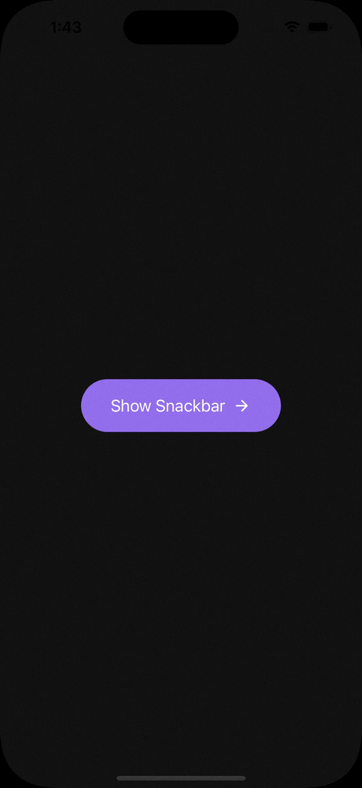

# react-native-global-components


> warning: this project is experimental & currently working hard on it 🧑🏻‍💻.
> please use when version 1.0.0 released.

## Overview


 

## How it works

- Provides global component API for `Snackbar`, `Popup`, `BottomSheet`
- Prevents **overlapped rendering** same type global components using rx observable and queue
- Once screen is occupied by global component, later `show` request is saved in queue and render asynchronously after previous global component is unmounted
- Global components are grouped by its type, global components with different types can be rendered together in screen
- Only one global component can be mounted with same type

## Getting Started

# Popup

## Props

No default props for popup. Props are inferred from your custom components.

## Methods

#### `show`

Request render. props type `P` is inferred from custom component.

```ts
show: (props: P) => void;
```

#### `hide`

Request unmount. Nothing happens if not component is mounted.

```ts
hide: () => void;
```

#### `clear`

Request unmount and clear all render list.

```ts
clear: () => void;
```

#### `setDelay`

Delay is time in milliseconds gap between switching global components. (default: 300ms)

Changing delay can have side effects for same type global components

ex) All pop-ups created by `createPopup` factory have shared delay

```ts
setDelay: (delay: number) => void;
```

#### `Portal`

Portal is host component to handle render request.

```ts
Portal: () => JSX.Element;
```

if using [react navigation](https://reactnavigation.org/), recommend to put under `NavigationContainer`.

```tsx
export default function RootNavigator() {
  useEffect(() => {
    // recommend for clean up prev states on hot replacement
    return () => {
      InputPopup.clear();
    };
  }, []);

  return (
    <>
      <NavigationContainer>
        <BottomTabNavigator />
      </NavigationContainer>
      <InputPopup.Portal />
    </>
  );
}
```

## Examples

```ts
import {
  createPopup,
  Overlay,
  useUpdateGlobalComponentState,
  useFadeAnimationStyle,
  KeyboardAvoidingContainer,
  useSlideAnimationStyle,
} from 'react-native-global-components';

interface InputPopupProps {
  onConfirm: () => void;
}

const InputPopup: React.FC<InputPopupProps> = (props) => {
  const { hide } = useUpdateGlobalComponentState();

  const { style } = useFadeAnimationStyle();

  const { style: slide } = useSlideAnimationStyle({ translateY: -30 });

  return (
    <KeyboardAvoidingContainer keyboardVerticalOffset={-100}>
      <Overlay />
      <Animated.View style={[styles.container, style, slide]}>
        <PopupUI onPress={hide} {...props} />
      </Animated.View>
    </KeyboardAvoidingContainer>
  );
};

export default createPopup(InputPopup);
```

use anywhere

```tsx
// App.tsx
import { InputPopup } from './some-dir-to-global-components';

const handlePress = () => {
  InputPopup.show({
    onConfirm: () => {
      console.log('yay!');
    },
  });
};
```

# Snackbar

## Props

| Key      | Type                         | Default     | Description                                                                                                       |
| -------- | ---------------------------- | ----------- | ----------------------------------------------------------------------------------------------------------------- |
| position | 'top' \| 'bottom'            | 'bottom'    | absolute position of snackbar                                                                                     |
| duration | number                       | 2000        | duration in milliseconds for how long to display snackbar. If `undefined`, never disappear until user interaction |
| offsetY  | number                       | 50          | offset in px from absolute position                                                                               |
| style    | AnimatedStyleProp<ViewStyle> | `undefined` | reanimated style                                                                                                  |

## Methods

#### `show`

Request render. props type `P` is inferred from custom Component.

Unlike Popup, Snackbar renders **immediately on show request** replacing previous rendered snackbar.

```ts
show: (props: P) => void;
```

#### `hide`

Request unmount. Nothing happens if not component is mounted.

```ts
hide: () => void;
```

#### `Portal`

Portal is host component to handle render request.

```ts
Portal: () => JSX.Element;
```

## Example

```tsx
import React, { useEffect } from 'react';
import { Image, TouchableWithoutFeedback, View } from 'react-native';
import {
  createSnackbar,
  Snackbar,
  SnackbarProps,
  useFadeAnimationStyle,
  useUpdateGlobalComponentState,
  useSlideAnimationStyle,
} from 'react-native-global-components';
import Animated from 'react-native-reanimated';

interface MySnackBarProps extends SnackbarProps {
  title: string;
  subtitle: string;
}

// implement custom component
const MySnackBar: React.FC<MySnackBarProps> = ({
  title,
  subtitle,
  ...props
}) => {
  const { style } = useSlideAnimationStyle({ translateY: -30 });

  const { style: fade } = useFadeAnimationStyle();

  const { hide } = useUpdateGlobalComponentState();

  return (
    <Snackbar {...props} style={style}>
      <TouchableWithoutFeedback
        onPress={() => hide()}>
        <Animated.View style={fade}>
          <SnackbarUI />
        </Animated.View>
      </TouchableWithoutFeedback>
    </Snackbar>
  );
};

export default createSnackbar(MySnackBar);

//  App.tsx don't forget portal
import { MySnackbar } from './some-dir-to-global-components';

const App = () => {
  return <>
    <NavigationContainer>
      <BottomTabNavigator />
      <MySnackbar.Portal />
    </NavigationContainer>
  </>
}

// Screen.tsx use anywhere
import { MySnackbar } from './some-dir-to-global-components';

const Screen = () => {
  return <View>
    <Button onPress={() => {
      MySnackbar.show({
        title: `Jerry's AirPods`,
        subtitle: 'Connected',
        position: 'top',
        duration: 2000,
      });
    }}>
 </View>
};
```

### Others

### Tips
